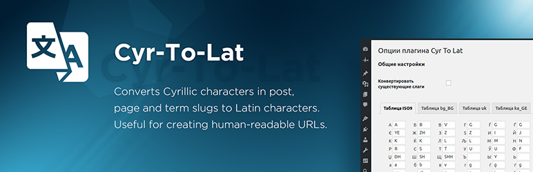

# Cyr-To-Lat

Converts Cyrillic characters in post, page and term slugs to Latin characters. Useful for creating human-readable URLs.



## Features

* The only plugin with fully editable transliteration table. Allows add/remove and edit pairs like 'Я' => 'Ya', or even 'Пиво' => 'Beer'
* Converts any number of existing post, page and term slugs in background processes
* Saves existing post and page permalinks integrity
* Performs transliteration of attachment file names
* Includes Russian, Belorussian, Ukrainian, Bulgarian, Macedonian, Serbian, Greek, Armenian, Georgian, Kazakh, Hebrew, and Chinese characters
* [Has many advantages over similar plugins](https://kagg.eu/en/the-benefits-of-cyr-to-lat/)
* [Officially compatible with WPML](https://wpml.org/plugin/cyr-to-lat/)


## Installation

```
git clone https://github.com/mihdan/cyr2lat.git
cd cyr2lat
make install-prod
```

## Development

```
git clone https://github.com/mihdan/cyr2lat.git
cd cyr2lat
make install
```

## WP-CLI support

```
wp cyr2lat regenerate [--post_type=<post_type>] [--post_status=<post_status>]
```

Where
  `-post_type` is list of post types,
  `-post_status` is list of post statuses.

## Packagist

[](https://packagist.org/packages/mihdan/cyr2lat)

[](https://packagist.org/packages/mihdan/cyr2lat)

[](https://packagist.org/packages/mihdan/cyr2lat)

[](https://packagist.org/packages/mihdan/cyr2lat)

[](https://packagist.org/packages/mihdan/cyr2lat)

## Code Coverage

[](https://coveralls.io/github/mihdan/cyr2lat?branch=master)

## License

The WordPress Plugin Cyr-To-Lat is licensed under the GPL v2 or later.

> This program is free software; you can redistribute it and/or modify it under the terms of the GNU General Public License, version 2, as published by the Free Software Foundation.

> This program is distributed in the hope that it will be useful, but WITHOUT ANY WARRANTY; without even the implied warranty of MERCHANTABILITY or FITNESS FOR A PARTICULAR PURPOSE. See the GNU General Public License for more details.

> You should have received a copy of the GNU General Public License along with this program; if not, write to the Free Software Foundation, Inc., 51 Franklin St, Fifth Floor, Boston, MA 02110-1301 USA

A copy of the license is included in the root of the plugin’s directory. The file is named `LICENSE`.

## Credits

The current version of the Cyr-To-Lat was developed by Sergey Biryukov, Mikhail Kobzarev, and Igor Gergel.

Contributors: [SergeyBiryukov](https://github.com/SergeyBiryukov), [mihdan](https://github.com/mihdan), [karevn](https://github.com/karevn), [webvitaly](https://github.com/webvitaly), [kagg-design](https://github.com/kagg-design).
